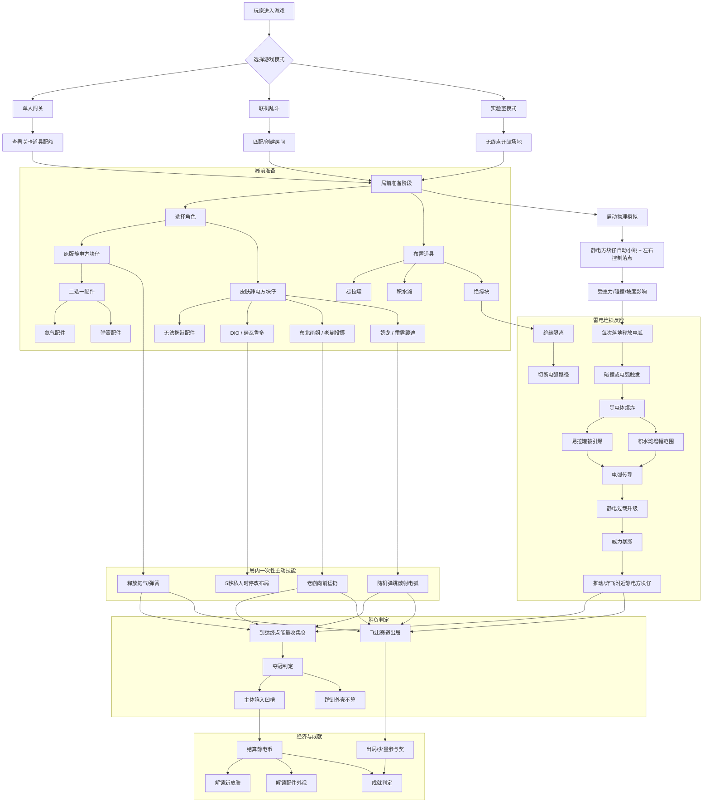

# 电极弹射 — 游戏设计文档（GDD）

> 版本：v1.3 — 核心操控明确为「自动小跳 + 左右落点控制 + 落地漏电」，统一全文描述。

---

## 1. 项目概述

### 1.1 游戏名称
**电极弹射**

### 1.2 核心定位
一款以「物理连锁爆炸 + 自动小跳 + 左右落点控制 + 局前布置」为核心机制的休闲派对/闯关游戏。强调**不可控的喜剧效果、高风险高收益的决策、以及联机互相坑害**。

### 1.3 一句话体验
> 静电方块仔会自己不停蹦跳，你只能控制它左右落点。每次落地都会漏电，摆好导电道具、抓准落点时机，把它弹向终点——或炸出赛道。

### 1.4 目标平台
- 优先：PC（Steam）
- 可扩展：移动端、主机

### 1.5 目标受众
- 喜欢《人类一败涂地》《Gang Beasts》《愤怒的小鸟》《Pummel Party》等物理喜剧游戏的玩家
- 轻度到中度玩家，适合直播/切片传播

### 1.6 美术风格建议
- 卡通、夸张、低多边形或手绘风格
- 色彩鲜明，爆炸特效张扬
- 角色造型：Q 版电极方块仔，不同皮肤在方块造型基础上变化

---

## 2. 核心玩法

### 2.1 底层规则

| 规则 | 说明 |
|------|------|
| 自动小跳 | 静电方块仔启动后会持续进行无法控制的小幅度跳跃 |
| 左右控制 | 玩家可以控制静电方块仔在空中的左右移动方向，决定下一次落点 |
| 落地漏电 | 每次落地都会释放一次电弧，与场景中的导电物体、积水、其他静电方块仔等可放电目标交互 |
| 布置阶段 | 在模拟开始前，玩家在赛道区域内摆放有限数量的道具 |
| 模拟阶段 | 点击开始后进入物理模拟，静电方块仔受环境、道具、碰撞影响前进 |
| 单次操作 | 局内仅有一次配件/大招释放机会，时机决定成败 |
| 物理驱动 | 所有移动、爆炸、弹跳均由物理引擎计算，结果不可完全预测 |

### 2.2 基础道具

每关提供固定配额，玩家需在布置阶段合理分配。

| 道具 | 类型 | 作用机制 | 策略价值 |
|------|------|----------|----------|
| **易拉罐** | 导电体 | 受到猛烈碰撞或电弧击中时产生雷霆爆炸，给予周围物体推力 | 核心推力来源，可触发连锁 |
| **积水滩** | 导电体（区域） | 大面积导电，放大经过的电弧威力并延长连锁传播范围 | 增幅器，适合铺在易拉罐群前 |
| **绝缘块** | 绝缘体 | 阻挡电弧传播，切断连锁爆炸路径 | 防御/隔离，避免误炸或保护关键路线 |

#### 道具交互规则
- 导电物体猛烈碰撞 → 触发电弧与爆炸
- 带电物体碰撞导电物 → 继续传导电弧
- 多个导电物连续传导 → 雪崩式连锁爆炸
- 连续爆炸次数越高 → 静电过载等级越高 → 单次爆炸威力暴涨

### 2.3 雷电机制详解

```
落地漏电 / 碰撞 / 初始触发
    ↓
导电体产生电弧 + 爆炸推力
    ↓
电弧击中附近导电体
    ↓
连锁传导，每次爆炸提升静电过载
    ↓
过载越高 → 推力越大、范围越广、越难控制
```

**设计目的**：让「刚刚好」的道具布局变成「过度爆炸」，制造翻车喜剧效果。

### 2.4 落地漏电机制

- 静电方块仔每次落地时，以落点为中心释放一次小范围电弧。
- 电弧优先寻找最近的导电体、积水滩或其他静电方块仔。
- 若命中可放电目标，触发爆炸与连锁反应。
- 若落点附近无可放电目标，电弧消散，仅播放漏电音效与屏幕微震。
- 落地越重（下落高度/速度越大），漏电范围与威力越大。

---

## 3. 局前配件系统

### 3.1 设计原则
- 仅**原版静电方块仔**可使用配件。
- 其他皮肤拥有专属大招，**不能携带配件**。
- 每局二选一，带入对局后**只能使用一次**。
- 配件与皮肤大招不冲突：原版无大招，所以配件就是其唯一主动技能。

### 3.2 氮气配件

| 项目 | 内容 |
|------|------|
| 触发方式 | 局内按键释放 |
| 效果 | 短时间给静电方块仔极强向前爆发加速 |
| 适用场景 | 冲刺终点、跨越长直道、快速脱离危险区 |
| 副作用 | 静电过载瞬间拉高；路过导电物件极易触发超大爆炸；推力过猛可能直接飞过终点摔出场外 |
| 风险关键词 | 冲过头、静电暴走、飞出赛道 |

### 3.3 弹簧配件

| 项目 | 内容 |
|------|------|
| 触发方式 | 局内按键释放 |
| 效果 | 静电方块仔猛地向上高高弹起，可越过大坑、矮墙 |
| 适用场景 | 跨越地形障碍、避开地面雷区 |
| 副作用 | 落地冲击力巨大，会引爆脚下一切导电道具；弹跳落点不可控，可能侧跳飞出赛道 |
| 风险关键词 | 落地爆炸、落点偏差、侧翻出局 |

### 3.4 配件与皮肤的兼容规则

| 角色 | 能否携带配件 | 主动技能 |
|------|--------------|----------|
| 原版静电方块仔 | ✅ 二选一 | 无皮肤大招，依赖配件 |
| DIO 静电方块仔 | ❌ | 专属大招：砸瓦鲁多 |
| 东北雨姐静电方块仔 | ❌ | 专属大招：老蒯投掷 |
| 奶龙静电方块仔 | ❌ | 专属大招：奶龙雷霆蹦迪 |

---

## 4. 胜利与失败

### 4.1 终点：能量收集仓

- 静电方块仔主体大部分陷入能量收集仓凹槽 → 判定夺冠
- 仅蹭到外壳/边缘 → 不算胜利
- 冲速过快 → 会从能量收集仓表面弹飞出局

### 4.2 胜利条件

| 模式 | 胜利条件 |
|------|----------|
| 单人闯关 | 静电方块仔成功卡进能量收集仓，完成关卡 |
| 联机乱斗 | 第一个主体陷入能量收集仓的玩家获胜；允许全员出局无冠军 |

### 4.3 出局条件

- 静电方块仔飞出赛道边界
- 被爆炸弹飞出界
- 被其他玩家顶出赛道
- 终点处弹飞

### 4.4 联机对抗特殊规则

- 静电方块仔之间可互相冲撞
- 已进入能量收集仓的玩家可被对手顶出
- 不到最后一刻胜负未定

---

## 5. 游戏模式

### 5.1 单人闯关模式

**流程：**
1. 进入关卡，查看道具配额与赛道布局
2. 布置阶段：摆放易拉罐、积水滩、绝缘块
3. 选择配件（原版）或皮肤（已解锁）
4. 启动模拟，静电方块仔自动小跳并受左右控制
5. 适当时机释放配件
6. 根据结果结算星级与静电币

**三星评级建议：**

| 星级 | 条件 |
|------|------|
| ⭐ | 成功通关 |
| ⭐⭐ | 通关且使用道具数量 ≤ 限制 |
| ⭐⭐⭐ | 通关且达成额外目标（如无配件通关、连锁爆炸次数 ≥ N 等） |

### 5.2 联机乱斗模式

**基础规则：**
- 支持最多 4 人同场
- 共用同一张赛道
- 每人独立道具配额
- 所有人布置的道具全局生效
- 布置完毕后统一启动模拟
- 所有静电方块仔自动小跳并受各自左右控制，落地漏电全场互通
- 所有大招、配件每局限一次
- 释放时全房间弹出提示

**胜负：**
- 第一个主体卡进能量收集仓者获胜
- 全员被炸飞则无冠军

### 5.3 实验室模式

- 开阔场地，无固定终点
- 目标：把静电方块仔弹射到最远距离
- 用于测试配件、皮肤效果与物理连锁
- 不计入成就与货币

---

## 6. 角色与皮肤

### 6.1 原版静电方块仔（初始免费）

| 项目 | 内容 |
|------|------|
| 皮肤大招 | 无 |
| 主动能力 | 局前二选一携带【氮气配件 / 弹簧配件】 |
| 定位 | 标准型，依赖玩家对道具布局和配件时机的把控 |

### 6.2 DIO 静电方块仔（静电币解锁）

**皮肤大招：The World · 砸瓦鲁多**

| 项目 | 内容 |
|------|------|
| 技能效果 | 开启 5 秒私人时停气泡 |
| 玩家视角 | 自己视角中世界静止，可新增、移动、旋转场上道具布置陷阱 |
| 其他玩家 | 正常运行，不会被冻结 |
| 限制 | 不能移动任何静电方块仔本体；不能删除别人摆放的道具 |
| 多人叠加 | 多名 DIO 可同时开启各自独立气泡，改动按先后顺序生效 |
| 定位 | 偷偷布局、阴人偷袭 |

### 6.3 东北雨姐静电方块仔（静电币解锁）

**皮肤大招：老蒯投掷**

| 项目 | 内容 |
|------|------|
| 技能效果 | 召唤老蒯抱起静电方块仔全力向前猛扔，获得巨大向前冲量 |
| 落地效果 | 落地撞击触发高强度雷霆爆炸 |
| 副作用 | 速度过快极易冲过终点飞出赛道；撞击与爆炸波及全场，可冲线也可撞飞对手 |
| 定位 | 暴力莽冲，肉身搅局 |

### 6.4 奶龙静电方块仔（静电币解锁）

**皮肤大招：奶龙雷霆蹦迪**

| 项目 | 内容 |
|------|------|
| 持续时间 | 3.5 秒 |
| 技能效果 | 高频随机弹跳，整体保持向右前进本能，玩家不能操控方向 |
| 落地效果 | 每次落地散射黄色小电弧，电弧碰到导电物触发连锁爆炸 |
| 额外效果 | 可跃过低矮障碍 |
| 副作用 | 弹跳随机左右摇摆，可能反向、侧跳摔出赛道；电弧容易误引爆坑自己；技能结束短暂打滑眩晕 |
| 定位 | 大范围随机搅局，打乱全场节奏 |

### 6.5 皮肤解锁

- 原版静电方块仔：默认解锁
- 其他皮肤：使用静电币解锁
- 皮肤仅改变外观与大招，不提供永久数值加成

---

## 7. 经济系统

### 7.1 货币：静电币

| 来源 | 说明 |
|------|------|
| 单人闯关 | 通关、达成三星、完成成就 |
| 联机对局 | 根据名次、存活时间、干扰对手数等结算 |
| 成就奖励 | 一次性奖励 |

### 7.2 消费点

- 解锁皮肤
- 解锁配件（若配件存在锁定的后续扩展）

### 7.3 重要原则

> **静电币只用于解锁皮肤与配件外观/使用权，不存在任何永久数值升级。**
>
> 所有强力手段（配件、皮肤大招）均伴随巨大风险，避免付费/肝度带来数值碾压。

---

## 8. 成就系统

### 8.1 成就分类

| 分类 | 示例 |
|------|------|
| 配件使用 | 氮气冲过了头、弹簧跳伞失败 |
| 皮肤大招 | 老蒯发力！、奶龙乱舞、砸瓦鲁多！ |
| 搞笑翻车 | 弹簧落雷、全员炸飞、无人生还 |
| 联机对抗 | 临门一脚挤出去、老蒯对砸瓦鲁多、把冠军顶出能量收集仓 |

### 8.2 成就示例列表

| 成就名 | 触发条件 |
|--------|----------|
| 老蒯发力！ | 使用雨姐大招成功冲线 |
| 奶龙乱舞 | 使用奶龙大招触发 10 次以上连锁爆炸 |
| 老蒯对砸瓦鲁多 | 在 DIO 时停期间被雨姐大招命中 |
| 临门一脚挤出去 | 在对手已进入能量收集仓后将其顶出 |
| 氮气冲过了头 | 使用氮气配件直接飞过终点摔出场外 |
| 弹簧跳伞失败 | 使用弹簧配件后落地被炸飞 |
| 砸瓦鲁多！ | 使用 DIO 大招成功布置陷阱并影响至少一名对手 |
| 无人生还 | 联机局中所有玩家全部出局 |

---

## 9. 关卡设计原则

### 9.1 单人关卡结构

```
起点 → 引导区（教学/简单道具） → 中段障碍/陷阱 → 高潮连锁区 → 终点能量收集仓
```

### 9.2 关卡元素

| 元素 | 作用 |
|------|------|
| 平地 | 测试基础连锁 |
| 大坑 | 弹簧配件或高速冲刺跨越 |
| 矮墙 | 需要弹跳或强力爆炸翻越 |
| 导电密集区 | 高风险高回报，可能把自己炸飞也可能飞速前进 |
| 绝缘通道 | 用绝缘块规划安全路线 |
| 终点前长直道 | 氮气配件最佳释放点，但容易冲过头 |

### 9.3 难度曲线

- 前期：教学道具单独作用
- 中期：要求组合使用 2-3 种道具
- 后期：精密布局 + 配件时机 + 物理随机性共同决定结果

---

## 10. 核心博弈与喜剧性

### 10.1 核心博弈

| 维度 | 决策点 |
|------|--------|
| 道具布局 | 哪里放易拉罐？哪里铺积水？哪里用绝缘块隔离？ |
| 落点控制 | 下一次落地应偏向左边还是右边？能否刚好引爆炸弹链？ |
| 配件/大招时机 | 早放可能浪费，晚放可能错过窗口 |
| 联机博弈 | 道具会坑别人也会坑自己；大招释放要提防对手 |
| 风险权衡 | 高推力 = 高速度 = 高失控风险 |

### 10.2 喜剧效果来源

1. **不可控物理**：精心布局被一次爆炸全盘打乱
2. **自我坑害**：为了坑对手放的道具反而把自己弹飞
3. **临门一脚**：眼看要赢，被对手顶出能量收集仓
4. **技能副作用**：氮气冲过头、奶龙反向跳、雨姐飞出赛道
5. **连锁雪崩**：一个小碰撞引发全场爆炸

### 10.3 设计底线

> 没有永久数值碾压。每一次胜利都应是玩家在当局的布局与时机决策换来的，而非肝度或付费。

---

## 11. 经典对局片段

### 片段 1：弹簧配件翻车
> 原版静电方块仔携带弹簧配件，眼看前面是巨坑按下弹簧起跳；落地正好砸在一堆易拉罐上，雷霆爆发直接把自己炸飞。

### 片段 2：四人混战
> DIO 偷偷埋陷阱；雨姐老蒯投掷横冲直撞；奶龙蹦迪全场乱炸；原版看准时机开氮气冲刺。四个角色技能互相博弈，最终全员炸飞，无人夺冠。

### 片段 3：临门一脚
> 雨姐大招冲到终点，主体刚陷入能量收集仓凹槽；原版静电方块仔紧随其后，一个冲撞把她顶出，自己滑入夺冠。

---

## 12. 音效与反馈建议

| 事件 | 反馈 |
|------|------|
| 静电方块仔落地 | 漏电噼啪声 + 屏幕微震 |
| 易拉罐爆炸 | 清脆金属音 + 电火花音效 |
| 连锁升级 | 音调逐渐升高，提示危险累积 |
| 配件释放 | 全屏提示 + 角色语音/特效 |
| 进入能量收集仓 | 能量充满音效 + 夺冠欢呼 |
| 出局 | 滑稽漏电短路音效 + 慢镜头 |

---

## 13. 后续扩展方向（非当前必须）

- 更多配件：磁力吸盘、降落伞、定时炸弹易拉罐等
- 更多皮肤：每个皮肤一个专属大招 + 副作用
- 关卡编辑器与玩家自制关卡
- 排行榜与赛季活动
- 观战/回放系统（突出搞笑瞬间）

---

## 14. 术语表

| 术语 | 解释 |
|------|------|
| 静电方块仔 | 玩家控制的主角实体 |
| 自动小跳 | 静电方块仔持续进行的不可控小幅跳跃 |
| 左右控制 | 玩家对静电方块仔落点左右方向的控制 |
| 落地漏电 | 静电方块仔每次落地释放的电弧交互 |
| 易拉罐 | 导电爆炸道具 |
| 积水滩 | 区域导电增幅道具 |
| 绝缘块 | 绝缘隔离道具 |
| 静电过载 | 连续连锁爆炸后威力暴涨的状态 |
| 静电币 | 游戏内货币 |
| 配件 | 原版静电方块仔局前选择、局内一次性使用的主动技能 |
| 皮肤大招 | 非原版皮肤的专属主动技能 |
| 能量收集仓 | 终点判定区域 |

---

## 15. 游戏系统关系总图

下图将模式选择、局前准备、核心玩法、道具连锁、皮肤大招、胜负与经济整合为一张关系树状图，便于快速理解各系统如何连接。



### 15.1 图的阅读说明

- **横向**：从左到右代表一局游戏的完整流程（进入 → 选择 → 准备 → 模拟 → 胜负 → 结算）。
- **纵向**：同一列内的节点互为分支，代表玩家在不同阶段的可选项或系统分支。
- **雷电连锁**：导电体之间通过电弧传导，绝缘体可以主动切断连锁路径。
- **皮肤与配件互斥**：只有原版静电方块仔能带配件；皮肤角色用专属大招替代配件。
